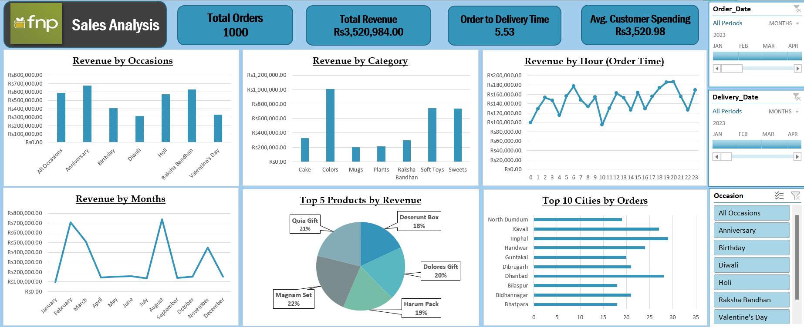

# Excel-Sales-Analysis-Dashboard-FNP
Excel-based Sales Analysis Dashboard for FNP showcasing insights into orders, revenue, product categories, occasions, and customer behavior using Pivot Tables, Charts, and Slicers.
# Excel Sales Analysis Dashboard – FNP  

This repository contains an **Excel-based Sales Analysis Dashboard** developed for **FNP (Ferns N Petals)**. The dashboard provides interactive insights into **orders, revenue, product categories, occasions, and customer behavior**, helping businesses make data-driven decisions.  

---

## 📊 Project Overview  
The dashboard leverages **Excel Pivot Tables, Pivot Charts, and Slicers** to analyze sales performance across multiple dimensions. It tracks overall KPIs, seasonal trends, and customer purchase behavior.  

**Key Metrics:**  
- **Total Orders:** 1,000  
- **Total Revenue:** Rs. 3,520,984  
- **Average Customer Spending:** Rs. 3,520.98  
- **Order-to-Delivery Time:** 5.53 days  

---

## 🔍 Dashboard Insights  
- **Revenue by Occasions:** Strong sales on **Anniversary, Valentine’s Day, Holi**.  
- **Revenue by Category:** **Colors, Soft Toys, Sweets** perform best; **Mugs and Plants** lag.  
- **Revenue by Hour:** Peak customer activity in **morning and evening**.  
- **Revenue by Months:** Spikes in **March** and **September** linked to festivals.  
- **Top Products:** *Magnam Set, Quia Gift, Dolores Gift, Harum Pack, Deserunt Box*.  
- **Top Cities:** *Imphal, Dhanbad, Kavali* lead in order volume.  

---

## ⚙️ Tools & Techniques  
- **Excel Pivot Tables** – data aggregation & analysis  
- **Pivot Charts** – visualization of KPIs  
- **Slicers** – interactive filtering (date, occasion, category)  
- **Data Cleaning & Processing** – ensuring accurate reporting  

---

## 🎯 Purpose  
This project shows how **Excel can serve as a Business Intelligence tool** by:  
- Identifying best-performing products & regions  
- Tracking seasonal sales patterns  
- Supporting marketing and logistics decisions  

---

## 📂 Repository Structure  

---

## 📷 Dashboard Preview  
  

---

## 🚀 Future Enhancements  
- Integration with **Power BI or Tableau** for richer visualizations  
- Automation with **Excel Macros / Python (Pandas, OpenPyXL)**  
- Adding **forecasting models** for revenue prediction  

